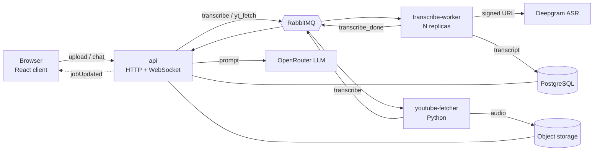
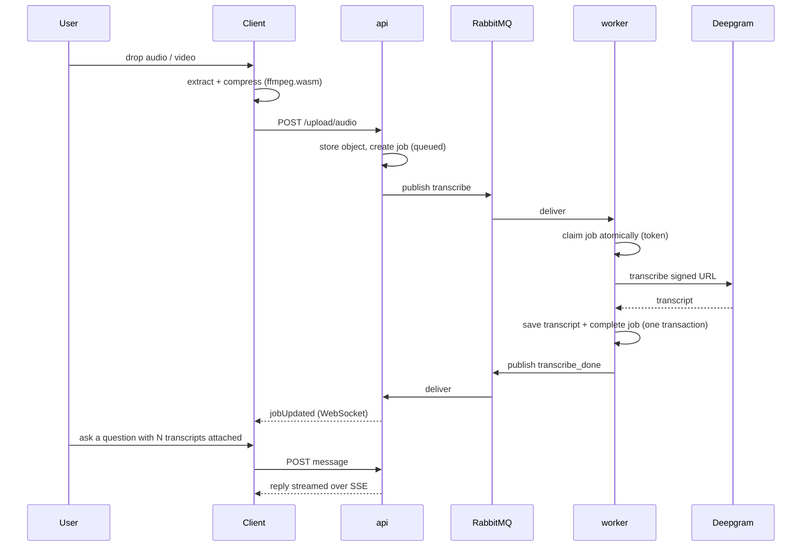

# GRADUATION PROJECT I REPORT

Summarizer: A Chat-Based System for Transcribing and Querying Audio, Video and YouTube Sources

Submitted By

Abdelrahman Qazzaz

Project Supervisor: Dr. Kholoud Nairokh

Graduation Project
Department of Computer Science
School of Computing
German Jordanian University

2026, Summer Semester

---

## Authorization Form

I, Abdelrahman Qazzaz, authorize the German Jordanian University to supply copies of this project report to libraries, or individuals, upon request.

Signature: ____________________

Date: 17 August 2026

---

Summarizer: A Chat-Based System for Transcribing and Querying Audio, Video and YouTube Sources

By

Abdelrahman Qazzaz

Supervisor

Dr. Kholoud Nairokh

---

## Abstract

Summarizer is a Full-Stack Web App that turns recorded speech into a conversation. A user submits an audio file, a video file, or a YouTube link; the system then extracts the speech, transcribes it, and stores the resulting text. The user can then ask questions about that material in a chat interface backed by a large language model. The feature the whole design turns on is that a single message may carry several transcripts at once, or a mix of transcripts and images, so questions can be asked across multiple recordings and images rather than one at a time.

The system is built as a modular monolith deployed as two Node.js process types (an HTTP/WebSocket API (main process) and a transcription worker that can be scaled horizontally, by forking it N number of times) plus a Python service (also horizontally scalable) that retrieves YouTube audio, communicating through a RabbitMQ message queue over a shared PostgreSQL database.

Transcription is separated into its own worker process, and YouTube retrieval into a separate Python service, because transcription is long-running and therefore has to run fully asynchronously. Jobs are claimed atomically using fencing tokens so that a broker redelivery cannot cause a stale worker to overwrite a newer result, and progress reaches the browser over a WebSocket. Video is decoded and compressed to audio in the browser before upload, so the original video is never transmitted. Model replies stream to the client over Server-Sent Events on a run that is deliberately decoupled from the response stream, so that if a client disconnects in the middle of receiving a response, the response still has its turn completed and stored.

Keywords: Automatic Speech Recognition, Transcription, Large Language Models, Message Queues, Asynchronous Processing, Web Application

---

## Acknowledgements

I would like to express my sincere gratitude to my project supervisor, Dr. Kholoud Nairokh, for her guidance, feedback and continuous support throughout the development of this project.

I would also like to thank the faculty members of the Department of Computer Science at the German Jordanian University for the foundation they provided.

---

## Table of Contents

1. Chapter I, Introduction
   1.1 Background
   1.2 Motivation
   1.3 Literature Review
2. Chapter II, Proposed Design and Methodology
   2.1 System Overview
   2.2 Implemented Systems
   2.3 Testing
   2.4 Ongoing Development and Methodology
3. References

---

## Nomenclature

| Term | Meaning |
| --- | --- |
| ASR | Automatic Speech Recognition |
| LLM | Large Language Model |
| API | Application Programming Interface |
| SSE | Server-Sent Events |
| ORM | Object-Relational Mapper |
| CTC | Connectionist Temporal Classification |

---

# Chapter I

## INTRODUCTION

### 1.1 Background

A large and growing share of information is produced as speech rather than text: recorded lectures, meetings, interviews, podcasts and online video. Speech is easy to produce and pleasant to listen to, but it is a poor medium for what people actually want to do afterwards, such as searching it, comparing two sources, or answering a question that depends on material scattered across an hour of talking. A listener who wants one fact from a ninety-minute recording has no better option than to listen through it.

Automatic Speech Recognition (ASR) is the obvious first step, and modern ASR is accurate enough to be useful on ordinary recordings without per-speaker training. But a transcript on its own only converts the problem from an unsearchable medium to a long one, since a ninety-minute lecture becomes tens of thousands of words and the reader still has to find the answer themselves.

What has changed recently is that large language models can take large amounts of text as context and answer specific questions about it. This makes a second step possible: transcribe the speech, then let the user interrogate the transcript in natural language. That combination is what this project implements and packages as a usable system.

### 1.2 Motivation

Transcription services generally stop at the transcript. They return a text file and treat the job as finished, which leaves the user with the same reading burden they started with. Conversely, general-purpose chat apps accept text but do not ingest media: a user must transcribe elsewhere, then copy and paste, then repeat that loop for every new recording.

More importantly, both approaches treat sources one at a time. In practice the useful questions are comparative: "where do these two lectures disagree?", "what did the last three meetings decide about this?", "what tasks were agreed on by the end of this team meeting?". Answering those requires several transcripts to be in front of the model simultaneously, in a known order, as part of one question. This is the capability the project is designed around, and it drives decisions throughout the system. The database records an ordered list of transcripts per message rather than a single reference, the context assembler budgets several transcript bodies against one character limit, and the user interface stages multiple sources on a message before it is sent.

A secondary motivation is practical robustness. Transcription of a long recording is slow, paid and failure-prone, so it cannot run inside an HTTP request. Building the system properly therefore requires a real asynchronous architecture: a queue, workers that scale independently, and correctness guarantees for production failures such as a worker dying mid-job. That made the project a suitable vehicle for distributed-systems concepts rather than only application-level programming.

### 1.3 Literature Review

#### Automatic Speech Recognition

Classical ASR pipelines required audio to be segmented and aligned with target labels before training. Graves et al. removed that requirement by introducing Connectionist Temporal Classification (CTC), a loss function that interprets a network's frame-level output as a distribution over all label sequences consistent with the transcript, allowing recurrent networks to be trained directly on unsegmented data [1]. CTC made end-to-end speech recognition practical and remains a component of many production systems.

The second shift was architectural. Vaswani et al. introduced the Transformer, replacing recurrence with self-attention and making sequence models substantially more parallelisable to train [2]. Applied to speech, this enabled far larger models trained on far more audio.

The third shift was one of data rather than architecture. Radford et al. trained a Transformer-based ASR model on 680,000 hours of weakly supervised multilingual audio collected from the web, and showed that the resulting system generalises across domains and accents in a zero-shot setting, approaching human robustness without dataset-specific fine-tuning [3]. This is the class of model that makes a project like Summarizer viable: general-purpose transcription accurate enough on arbitrary user-supplied recordings to be worth building a product on, and available as a hosted API rather than as infrastructure the developer must train and operate.

#### From Summarisation to Question Answering over Transcripts

Early neural summarisation was extractive or short-form abstractive. See et al. addressed two well-known failures of abstractive models, the inability to reproduce rare words and the tendency to repeat, with a pointer-generator network that copies tokens directly from the source [4]. Lewis et al. later showed that a denoising sequence-to-sequence pre-training objective (BART) transfers strongly to generation tasks including summarisation, establishing the pre-train-then-fine-tune pattern [5].

Instruction-following LLMs generalised this further: rather than fine-tuning a dedicated summarisation model, a capable general model can be prompted with the source text and an arbitrary instruction. That matters here because it means the user's question, not a fixed summarisation objective, determines the output. Summarizer therefore does not summarise transcripts on ingestion; it stores the transcript and defers all interpretation to the moment the user asks something.

The task this creates is close to what Zhong et al. formalised as query-based meeting summarisation, in which a model must locate and summarise the spans of a long, multi-speaker transcript that are relevant to a specific query, across several domains [6]. Their benchmark also documents the core difficulty this project must engineer around: meeting transcripts are long, and relevance is sparse and scattered, so what is placed in the model's context window matters as much as the model does.

#### Asynchronous Processing and Correctness

Because transcription cannot run inside a request, the architectural literature on long-running work is directly relevant. Kleppmann's treatment of distributed data systems describes the failure mode this project must defend against: a worker that is presumed dead, whose task is reassigned, but which later resumes and writes a stale result. The standard defence is a monotonically increasing fencing token checked at the point of the write, so that a write from a superseded worker is rejected [7]. Summarizer implements exactly this pattern with per-claim tokens on transcription jobs, described in Section 2.2.

---

# Chapter II

## PROPOSED DESIGN AND METHODOLOGY

### 2.1 System Overview

Summarizer is implemented as a modular monolith: one codebase and one build artifact, started at different entry points as different process types, communicating asynchronously. This was a deliberate choice over microservices, because the processes share one database and one deployment cadence, so the operational cost of separate services would buy nothing, while the asynchronous decoupling that actually matters (scaling transcription independently of the API) is provided by the message queue.

Three process types are deployed:

- api: the HTTP and WebSocket service the browser talks to. Handles authentication, uploads, conversations, chat turns, and job queries.
- transcribe-worker: a pure queue consumer with no HTTP surface, run as N replicas. Because the workers are competing consumers on one queue, scaling throughput is purely a matter of replica count; no load balancer is involved, since workers pull work rather than receive it.
- youtube-fetcher: a separate Python service that downloads audio for YouTube submissions using yt-dlp and places it in object storage.

Figure 1. System architecture.

Supporting infrastructure: PostgreSQL (accessed through the Drizzle ORM, using Supabase) for all relational state, Supabase Storage for audio and image objects, Redis for caching and rate-limit counters, Socket.IO for pushing job updates to the browser, WorkOS AuthKit for authentication, Deepgram for calling transcription models, and OpenRouter for calling text-based models. Every process runs a fail-fast preflight check on boot: if a dependency it needs is unreachable, it aborts rather than starting half-alive. Failing fast and loudly is easier to debug than a defensively written system, where a missing dependency might not surface until much later.

The end-to-end path for an uploaded recording is shown below.

Figure 2. End-to-end flow from upload to answered question.

### 2.2 Implemented Systems

#### 2.2.1 Client-Side Media Preparation

Uploading raw video is wasteful, because the system only needs the speech. The client therefore performs media preparation in the browser using ffmpeg.wasm. Video files are demuxed and decoded to extract the audio track; all audio is then re-encoded to mono, 16 kHz Opus at a low bitrate, which is well matched to speech recognition and dramatically smaller than the original. The original video bytes are never transmitted, which reduces upload time and storage cost and keeps the video itself on the user's device.

#### 2.2.2 Transcription Pipeline and Atomic Job Claiming

An upload creates a job row in the queued state and publishes a message naming it. A worker consumes the message, transcribes the audio, and writes the result. The channel uses a prefetch of one per consumer, so a worker handles at most one transcription at a time and work is spread across replicas rather than buffered in one.

The correctness problem is redelivery. RabbitMQ redelivers an unacknowledged message once its consumer's connection closes, but a worker isolated by a network partition may still be mid-call and may still finish. Without protection, the original worker could write its result after a replacement had already produced a newer one.

The system defends against this with atomic claiming and fencing tokens. Claiming a job is a single conditional database update: a fresh delivery may claim only a job in the queued state, while a redelivery may reclaim one that is processing. Every successful claim writes a new (randomly generated) token to the row and returns it to the claimant. Terminal writes are conditional on still owning that token, so a superseded worker's write matches no row and is discarded. Storing the transcript and marking the job complete happen in one transaction, so a crash cannot leave a completed job with no transcript or a transcript attached to an unfinished job.

#### 2.2.3 YouTube Ingestion

A YouTube submission takes the same path, but with one extra step earlier. The API creates the job with placeholder file metadata, because the real title and size are unknown until the download completes, and publishes to a separate queue consumed by the Python fetcher. The fetcher downloads the audio with yt-dlp, writes it to object storage under the job's identifier, and then publishes to the ordinary transcription queue. From that point the job is indistinguishable from a direct upload. The two services share queue and bucket names through a small contract endpoint the fetcher reads at boot, so those names are defined once rather than mirrored and maintained by hand. The endpoint is unauthenticated because it returns no sensitive data. This also means that if a change is made on the Node API side but not on the youtube-fetcher side, which is easy to do when several people work on the project, the fail-fast convention catches it: the process throws immediately on startup rather than failing later in a confusing way.

#### 2.2.4 Transcript Storage and Context Budgeting

Transcripts are stored in a table separate from the job row, keyed by the upload identifier, alongside a character-count column. This separation is a deliberate performance decision with two consequences. First, listing a user's jobs never drags multi-megabyte transcript bodies through the database. Second, and more importantly, the chat context assembler can decide which transcripts fit inside the model's character budget by reading only their stored lengths, and then fetch the bodies of just those that were admitted.

The budget itself is explicit. A conversation replays at most fifty prior turns, and history is admitted newest-first until a 100,000-character budget is spent, truncating at the first turn that does not fit. A turn's cost is its own text plus the lengths of the transcripts attached to it. Images from earlier turns are replayed under their own separate cap. The new turn is always included regardless of size; if it alone exceeds the budget the request is rejected with an explicit error rather than being silently truncated.

#### 2.2.5 Multiple Transcripts per Message

This is the system's defining feature. A join (Many-to-Many) table records the transcripts attached to a chat message together with a position column, so a message carries an ordered list rather than a single reference. On send, the client submits the transcript identifiers in the order the user staged them; the server persists that order and, when building the prompt, prepends the transcript bodies in the same order ahead of the user's own text.

Attached transcripts are also replayed on later turns, so a follow-up question about a recording mentioned three turns ago still sees it. Because a transcript is referenced by identifier rather than copied, attaching an already-transcribed recording to a new message costs nothing: no re-upload and no second transcription.

#### 2.2.6 Streaming Replies

Chat replies stream to the browser over Server-Sent Events, one event per model chunk followed by a completion event carrying the new head of the conversation. Because the endpoint is a POST with a JSON body, the browser's EventSource API cannot be used, so the client reads the stream with fetch instead.

The run that produces the reply is deliberately decoupled from the response stream. If the client disconnects mid-answer, the model call still runs to completion and the turn is still persisted; the stored conversation, not the stream, is the source of truth. A dropped connection is therefore a display problem rather than a data-loss problem, since the client refetches and finds the completed turn.

Concurrency within a conversation is controlled by a claim on the conversation row: starting a turn requires the client to submit the message identifier it believes to be current, so two overlapping sends cannot interleave. A mismatch is reported as a conflict rather than silently accepted.

#### 2.2.7 Realtime Updates, Rate Limiting and Authentication

When a transcription finishes, the worker publishes a completion message that the API forwards to the owning user's Socket.IO room, so the browser learns of it without polling. The socket is authenticated from the same session cookie as the HTTP API, and each one joins a room named for its user, which scopes delivery.

All authenticated routes are rate limited per user in fixed windows backed by Redis, with separate budgets for reads, uploads and model calls, so an expensive operation cannot be driven in a loop. Authentication is delegated to WorkOS AuthKit; the application stores no passwords and receives only a stable user identifier, which it uses as the ownership key on every table. Object keys are namespaced by user, so a request for another user's object fails structurally rather than by a permission check.

#### 2.2.8 Client Application

The client is a single-page React application built with Vite, styled with Tailwind CSS, with server state managed by TanStack Query. It presents one chat-first surface: a conversation list, the conversation itself, and a composer.

Sources are staged directly in the composer, dropped onto the page, chosen from a menu, pasted, or picked from a library of previously transcribed material, and they begin uploading the moment they are added rather than on send. Each staged source advances through preparing, uploading, transcribing and ready, and the send action stays disabled until every source has landed, with a line naming what it is waiting for. This is not cosmetic: the API rejects a turn that references a transcript the worker has not yet written, so the interface makes that constraint visible instead of letting the user hit an error. Pasting a YouTube link prompts the user to transcribe it and attach the result.

Job progress reaches the client by WebSocket push. Polling is used only while the socket is disconnected, and a reconnect triggers a refetch, so the normal case costs no additional requests.

### 2.3 Testing

The project has an automated test suite of 30 test files containing 169 test cases. On the Node.js side, 141 cases cover three layers: HTTP API tests exercising the real route handlers (authentication, uploads, conversations, messages, jobs, rate limiting), unit tests for the data-access and message-queue modules, and worker tests covering the transcription job path. The Python fetcher has a further 28 tests of its own. Correctness-critical behaviour is tested directly, including job claiming, transcript persistence and the message-queue publisher and consumer. Manual browser testing is used for the interface, with an isolated authenticated session so that flows involving real uploads and real transcription can be exercised end to end.

### 2.4 Ongoing Development and Methodology

Development followed an iterative methodology: a working vertical slice first (upload, transcribe, display), with each subsequent capability added on top of a system that already ran and the architecture refactored as requirements demanded rather than designed in full up front. The project comprises roughly 174 source files across the three services and 305 commits, kept small and dependency-ordered so that each is reviewable in sequence.

The next planned feature is voice input in the message box. Rather than relying on the operating system's built-in dictation, the application would capture the user's voice in the browser, upload the recording, transcribe it through a low-latency speech recognition endpoint, and insert the resulting text into the composer for the user to edit before sending. This is the approach taken by current assistant web applications, and it is a better fit than native dictation because the application controls which model is used and behaves identically on every device. Most of the pipeline already exists, since the client can already capture and compress audio and the transcription path is already built; what it needs is a shorter route than the queued batch pipeline, because a dictated sentence must return in about a second rather than queueing behind hour-long recordings.

Several areas also remain in development and are worth stating plainly:

- Idempotency of retried requests. Upload and chat endpoints generate a fresh identifier per call, so a request whose response is lost and is then retried by the client can create a duplicate job, and potentially a second paid transcription. The fix is an explicit idempotency key supplied by the client and enforced by the server.
- Recovery of a failed re-run. Re-running a transcription sets the job back to queued, deletes the old transcript and republishes. If publishing fails after the state change, the job is left queued and a retry is rejected as already-in-progress, so it cannot recover without manual intervention.
- Dead-letter handling. Handler exceptions currently negatively acknowledge without requeueing while the retry and dead-letter exchanges are declared but not wired, so a transient database failure can drop a job's message.
- Orphaned storage objects. Deletion removes database rows before storage objects; if the storage call fails, a retry finds the rows already gone and the object is left behind.
- Message history pagination. A conversation's messages are returned in full on every load, which will not scale to long conversations and should become a cursor-paginated read.

These are documented and specific rather than vague, and closing them is the immediate next phase of work, ahead of any new user-facing features.

---

## References

[1] A. Graves, S. Fernández, F. Gomez and J. Schmidhuber, "Connectionist Temporal Classification: Labelling Unsegmented Sequence Data with Recurrent Neural Networks," in Proceedings of the 23rd International Conference on Machine Learning (ICML), 2006, pp. 369-376.

[2] A. Vaswani, N. Shazeer, N. Parmar, J. Uszkoreit, L. Jones, A. N. Gomez, L. Kaiser and I. Polosukhin, "Attention Is All You Need," in Advances in Neural Information Processing Systems (NeurIPS), 2017. arXiv:1706.03762.

[3] A. Radford, J. W. Kim, T. Xu, G. Brockman, C. McLeavey and I. Sutskever, "Robust Speech Recognition via Large-Scale Weak Supervision," arXiv:2212.04356, 2022.

[4] A. See, P. J. Liu and C. D. Manning, "Get To The Point: Summarization with Pointer-Generator Networks," in Proceedings of the 55th Annual Meeting of the Association for Computational Linguistics (ACL), Vancouver, Canada, 2017, pp. 1073-1083. arXiv:1704.04368.

[5] M. Lewis, Y. Liu, N. Goyal, M. Ghazvininejad, A. Mohamed, O. Levy, V. Stoyanov and L. Zettlemoyer, "BART: Denoising Sequence-to-Sequence Pre-training for Natural Language Generation, Translation, and Comprehension," arXiv:1910.13461, 2019.

[6] M. Zhong, D. Yin, T. Yu, A. Zaidi, M. Mutuma, R. Jha, A. Hassan Awadallah, A. Celikyilmaz, Y. Liu, X. Qiu and D. Radev, "QMSum: A New Benchmark for Query-based Multi-domain Meeting Summarization," in Proceedings of the 2021 Conference of the North American Chapter of the Association for Computational Linguistics: Human Language Technologies (NAACL-HLT), 2021, pp. 5905-5921. arXiv:2104.05938.

[7] M. Kleppmann, Designing Data-Intensive Applications, Sebastopol, CA: O'Reilly Media, 2017.
